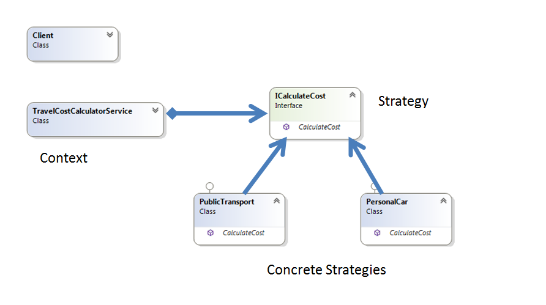

# Strategy
### Behavioral Design Pattern

## Описание
Широко приетата дефиниция на шаблона за дизайн Strategy е следната: "Strategy pattern определя група от алгоритми, енкапсулира всеки един от тях и ги прави лесно заменяеми". За да се разбере по-лесно описанието може да се раздели на 3 части.

1) Група от алгоритми - имаме функционалност която  би постигнала желаната цел за даден обект, но постигната по различен начин.

2) Енкапсулиране на логиката - този шаблон за дизайн ни кара да дефинираме всяка една различна логика в отделен клас, като в последствие избираме кой от тях да ползваме.

3) Лесно заменяеми - голямото преимущество на Strategy е че може по време на изпълнение на кода да избираме, кой точно алгоритъм искаме да приложим. 

Също така този дизайн ни помага да избягваме използването на switch конструкции или множество if - else-a

## Implemntation
Кратко демо за изчисляването на разходите за път при използването на различни превозни средства

###### public interface ICalculateCost - т.нар Strategy клас. Задава необходимите входни параметри и очаквания тип данни които да получим като резултат, имплементацията е оставена на класовете които наследяват интерфейса.
~~~c#
public interface ICalculateCost
    {
        decimal CalculateCost(double distace);
    }
~~~

###### public class PersonalCar (идентичен е с класа PublicTransport) - това е Concrete Strategy класа. Задава своята собствена имплементация на стратегията
~~~c#
public class PersonalCar : ICalculateCost
    {
        private const decimal CostsPerKm = 0.55M;

        public decimal CalculateCost(double distace)
        {
            return (decimal)distace * CostsPerKm;
        }
    }
~~~

###### public class TravelCostCalculatorService - т.нар. Context Клас. Грижи се за изпълнението на заявките от страна на клиента и да приложи желаната стратегия. 
~~~c#
public class TravelCostCalculatorService
    {
        private readonly ICalculateCost travelStrategy;

        public TravelCostCalculatorService(ICalculateCost travelStrategy)
        {
            this.travelStrategy = travelStrategy;
        }

        public void DisplayCost(double distance)
        {
            var costs = this.travelStrategy.CalculateCost(distance);
            Console.WriteLine("Travelling {0}km with {1} would cost you {2:C2}", distance, this.travelStrategy.GetType().Name, costs);
        }
    }
~~~

###### Използване от страна на клиента - Получава възможността да изчисли своите разходи в зависимост от това каква стратегия за придвижване избере. Лесно се използват/заменят различните стратегии. 
~~~c#
public class Client
    {
        public static void Main()
        {
            double distanceToGradina = 410;
            var travelTypeOne = new PersonalCar();
            var getCosts = new TravelCostCalculatorService(travelTypeOne);
            getCosts.DisplayCost(distanceToGradina);

            Console.WriteLine(new string('-', 50));

            var travelTypeTwo = new PublicTransport();
            getCosts = new TravelCostCalculatorService(travelTypeTwo);
            getCosts.DisplayCost(distanceToGradina);
        }
    }
~~~

###### Демо: [Link to GitHub](https://github.com/clangelov/TelerikAcademyHomework/tree/master/08_High-QualityCode/BehavioralPatterns-Homework/demos/StrategyPatternTransportCostDemo) 
