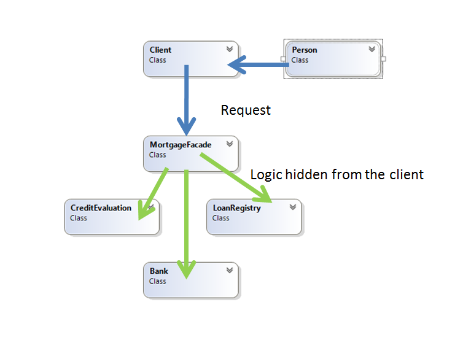

# Facade
### Structural Design Pattern

## Описание
Целата на този модел е да скрие сложността на системата и да осигури на клиента един интерфейс с помощта на който клиентът може да ползва цялата функционалност.

Този модел включва един клас, който съдържа в себе си набор от под-класове, които са необходими за изпълнение на заявката на клиента. По този начин Фасадата крие подробностите по самото изпълнение и предоставя готова функционалност.

Този шаблон за дизайн може да се използва, когато една система е много сложна или трудна за разбиране и/или има голям брой взаимосвързани класове.

## Implemntation
Кратко демо за отпускането на ипотечен заем

###### public class Person – служи само за създаване на обекта, който иска да получи заем
~~~c#
public class Person
    {
        public Person(string name, decimal monthlyIncome)
        {
            this.Name = name;
            this.MonthlyIncome = monthlyIncome;
        }

        public string Name { get; set; }

        public decimal MonthlyIncome { get; set; }
    }
~~~

###### public class MortgageFacade Играе ролята на Facade, предоставя на клиента само един метод, а вътре под себе си извършва всички необходими опреации, за да бъде изпълнена заявката към него
~~~c#
public class MortgageFacade
    {
        private Bank bank = new Bank();
        private LoanRegistry loanRegistry = new LoanRegistry();
        private CreditEvaluation creditEvaluation = new CreditEvaluation();

        public bool IsEligible(Person person)
        {
            Console.WriteLine("{0} applies for mortgage", person.Name);

            bool eligible = true;

            // Check creditworthyness of applicant
            if (!this.bank.HasSufficientSavings(person))
            {
                eligible = false;
            }
            else if (!this.loanRegistry.HasNoBadLoans(person))
            {
                eligible = false;
            }
            else if (!this.creditEvaluation.HasGoodCreditRating(person))
            {
                eligible = false;
            }

            return eligible;
        }
    }
~~~

###### public class Bank скрит е под Фасадата проверява дали клиента има досатъчен месечен доход
~~~c#
public class Bank
    {
        private const decimal MinimumMonthlyIncome = 1000;

        public bool HasSufficientSavings(Person person)
        {
            if (person.MonthlyIncome > MinimumMonthlyIncome)
            {
                Console.WriteLine("Checking for sufficient monthly income of {0}", person.Name);
                return true;
            }
            else
            {
                return false;
            }            
        }
    }
~~~

###### public class CreditEvaluation - добавя допълнителни проверки за клиента
~~~c#
public class CreditEvaluation
    {
        public bool HasGoodCreditRating(Person person)
        {
            Console.WriteLine("Check credit rating for " + person.Name);

            // some logic
            return true;
        }
    }
~~~

###### public class LoanRegistry - добавя допълнителни проверки за клиента
~~~c#
   public class LoanRegistry
    {
        public bool HasNoBadLoans(Person person)
        {
            Console.WriteLine("Checking  " + person.Name + " credit history");

            // some logic
            return true;
        }
    }
~~~

###### Използване от страна на клиента - цялата дейснот се извършва от Фасадата в случая new MortgageFacade(), клиента накрая получава готовия резултат от своята заявка, без да е необходимо да минава през отделните стъпки
~~~c#
public class Client
    {
        public static void Main()
        {
            var mortgage = new MortgageFacade();
            var person = new Person("Mike Johnson", 1050M);
            bool eligible = mortgage.IsEligible(person);

            Console.WriteLine("{0} has been {1} for a mortgage", person.Name, eligible ? "Approved" : "Rejected"); 
        }
    }
~~~

###### Демо: [Link to GitHub](https://github.com/clangelov/TelerikAcademyHomework/tree/master/08_High-QualityCode/StructuralPatterns-Homework/demos/FacadeMortgageApplicationDemo)
