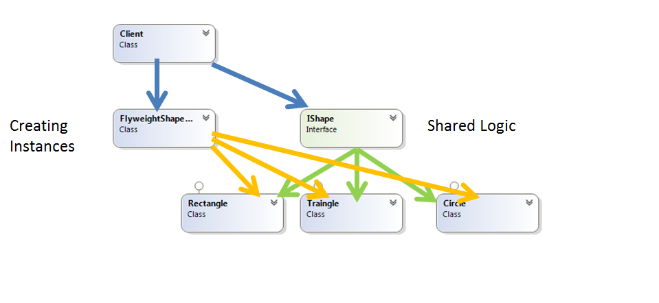

# Flyweight 
### Structural Design Pattern

## Описание
Шаблона за дизайн Flyweight се използва за да бъде намален броят на създаваните обекти и по този начин да намали използването на памет и ресурси от страна на приложението. Като крайният резултат е подобряване на производителността

Този дизайн се опитва да преизползва вече създадени и приличащи си обекти, които да запазва и да създава нови обекти единствено и само ако поискания обект не е вече създаден.

Трябва да се обърне особено внимание когато се създават обекти от няколко нишки в програмата. В този случай ако знаем предварително какви обекти са нужни е добре да се създадат предварително и да се достъпват от някой контейнер.

## Implemntation
Кратко демо за създаването на много геометрични фигури

###### public interface IShape – имплементира функционалността на обектите, които ще бъдат създавани във факторито и после използвани от клиента   
~~~c#
 public interface IShape
    {
        void Print();
    }
~~~

###### public class Circle това е т.нар. "concrete" имплемнтация на интерфейса, класа е напълно аналогичен и с другите фигури Traingle и Rectangle
 ~~~c#
public class Circle : IShape
    {
        public void Print()
        {
            Console.WriteLine("Drawing a {0} to the console", this.GetType().Name);
        }
    }
~~~

###### public class FlyweightShapeFactory менажира процеса по създаване на обекти. Класа съдържа референция към вече създадените обекти. Когото постъпи заявка от страна на клиента през метода GetShape се преценява дали да се съдаде или преизползва дадения обект.
~~~c#
public class FlyweightShapeFactory
    {
        private readonly Dictionary<string, IShape> shapes = new Dictionary<string, IShape>();

        public int NumberOfObjects
        {
            get
            {
                return this.shapes.Count;
            }
        }

        public IShape GetShape(string key)
        {
            // Uses "lazy initialization"
            IShape shape = null;
            if (this.shapes.ContainsKey(key))
            {
                shape = this.shapes[key];
            }
            else
            {
                switch (key)
                {
                    case "circle":
                        shape = new Circle();
                        break;
                    case "triangle":
                        shape = new Traingle();
                        break;
                    case "rectangle":
                        shape = new Rectangle();
                        break;
                    default:
                        throw new InvalidOperationException("This is an invalid command");
                }

                this.shapes.Add(key, shape);
            }

            return shape;
        }
    }
~~~

###### Използване от страна на клиента - необходимо е едиствено да се създаде Flyweight факторите, което да ни даде достъп до функционалността на създаваните обекти (които са имплементирани в Flyweight интерфейса: IShape)
~~~c#
public class Client
    {
        private static readonly string[] Keys = { "circle", "triangle", "rectangle" };        

        public static void Main()
        {
            Random random = new Random();
            var factory = new FlyweightShapeFactory();            

            for (int i = 0; i < 10; i++)
            {
                var shape = factory.GetShape(Keys[random.Next(0, Keys.Length)]);
                shape.Print();
            }

            Console.WriteLine("After 10 request there are {0} objects in the Flyweight Shape Factory", factory.NumberOfObjects);            
        }
    }
~~~

###### Демо: [Link to GitHub](https://github.com/clangelov/TelerikAcademyHomework/tree/master/08_High-QualityCode/StructuralPatterns-Homework/demos/FlyweightFiguresDemo)
